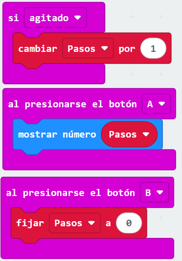

# Ejercicio "Contador de Pasos"
Codigo probado en: https://python.microbit.org/v/3/reference
---
## EN PYTHON
```PY
from microbit import *

pasos=0 

while True:
    if accelerometer.was_gesture("shake"):
        pasos += 1
        display.show(pasos)

    if button_b.is_pressed():
        pasos=0
        display.show("R")

    if button_a.is_pressed():
        display.show(str(pasos))
```
---
## EN BLOQUES
